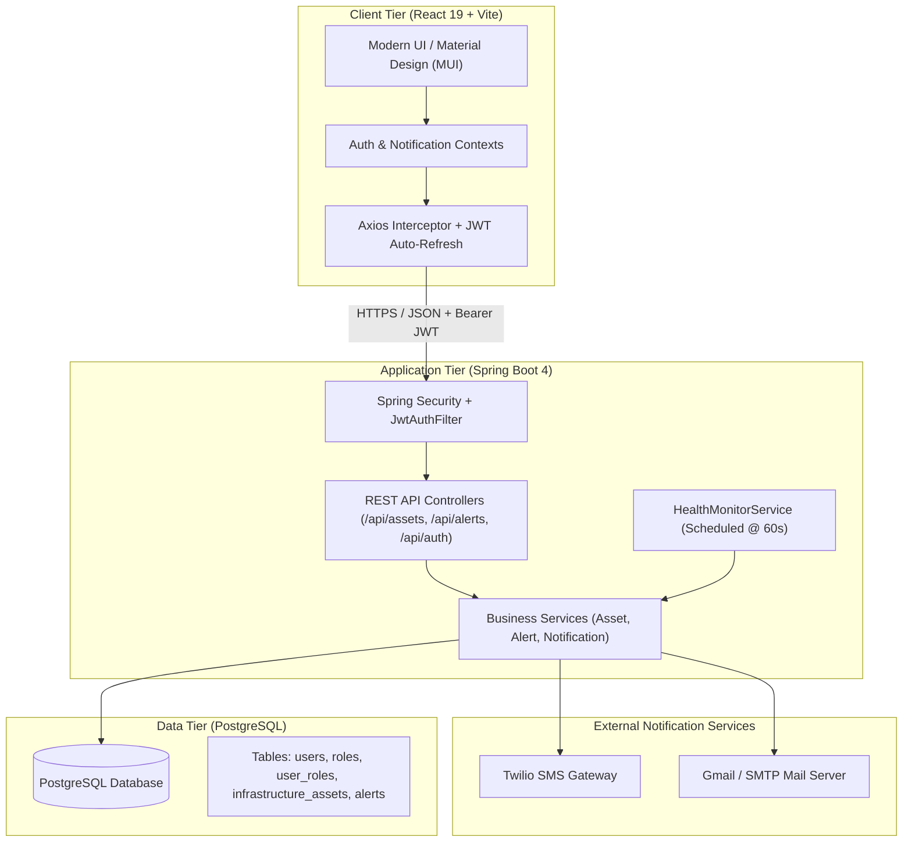
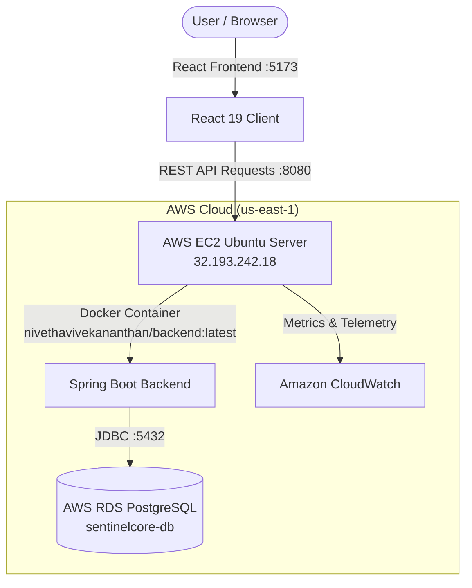

# 🛡️ SentinelCore — Cloud Security & Infrastructure Monitoring System

[](https://www.oracle.com/java/)
[](https://spring.io/projects/spring-boot)
[](https://react.dev/)
[](https://vitejs.dev/)
[](https://www.postgresql.org/)
[](https://spring.io/projects/spring-security)
[](https://www.docker.com/)
[](https://aws.amazon.com/ec2/)
[](https://aws.amazon.com/rds/)
[](https://hub.docker.com/r/nivethavivekananthan/backend)

> **SentinelCore** is an enterprise-grade cloud security and infrastructure monitoring platform designed to provide real-time telemetry, proactive threshold breach detection, multi-channel alerting (SMS & Email), strict role-based access control (RBAC), and verifiable incident lifecycle auditing with Mean Time to Resolution (MTTR) tracking.

---

## 📑 Table of Contents

- [Overview](#-overview)
- [System Architecture](#-system-architecture)
- [Key Features](#-key-features)
- [Technology Stack](#-technology-stack)
- [Pre-Configured Demo Accounts](#-pre-configured-demo-accounts)
- [REST API Reference](#-rest-api-reference)
- [Metric Thresholds & Alerting Rules](#-metric-thresholds--alerting-rules)
- [Project Directory Structure](#-project-directory-structure)
- [Getting Started](#-getting-started)
  - [Prerequisites](#prerequisites)
  - [1. Database Configuration](#1-database-configuration)
  - [2. Backend Setup (Spring Boot)](#2-backend-setup-spring-boot)
  - [3. Frontend Setup (React + Vite)](#3-frontend-setup-react--vite)
  - [4. Docker Deployment](#4-docker-deployment)
- [Evaluation & Demo Walkthrough](#-evaluation--demo-walkthrough)
- [License](#-license)

---

## 🌐 Overview

Modern cloud environments require continuous observability, defense-in-depth security, and rapid remediation capabilities. **SentinelCore** delivers a centralized monitoring command center that tracks health metrics across servers, databases, routers, and firewalls.

The system continuously audits CPU, RAM, Disk, and Network telemetry through a background daemon. When thresholds breach defined operating parameters, SentinelCore triggers immediate automated incident response—dispatching SMS via Twilio, delivering structured email notifications via SMTP, and logging immutable audit events with timestamps to compute resolution times accurately.

---

## 🏗️ System Architecture

SentinelCore is built following a decoupled, layered client-server architecture with defense-in-depth principles:



---

## ✨ Key Features

### 1. 🛡️ Defense-in-Depth Security & Two-Tier RBAC
- **Dual-Token Authentication**: Employs stateless 15-minute JWT Access Tokens accompanied by 7-day Refresh Tokens stored securely to enable seamless, background session renewal.
- **BCrypt Password Hashing**: Passwords stored using BCrypt cost factor 10 with salt, defeating dictionary and rainbow table attacks.
- **Granular Server-Side RBAC**: Protected by Spring Security `@PreAuthorize("hasRole('ADMIN')")`.
  - **`ROLE_ADMIN`**: Full permissions — register, inline edit, decommission assets, and resolve security incidents.
  - **`ROLE_VIEWER` / `ROLE_OPERATOR`**: Read-only access — live dashboard, asset inspection, and alert history audit trail without unauthorized write capabilities.

### 2. 📊 Real-Time Telemetry & Executive Dashboard
- **KPI Overview Cards**: Displays Total Assets, Operational Online, Degraded/Offline, and Active Critical Incidents at a glance.
- **Health Gauges**: Live visual progress indicators for System Uptime %, Average CPU Usage, and Average Memory Usage.
- **Interactive Metric Visualizations**: Comprehensive resource distribution bar charts rendered with Recharts.

### 3. ⚡ Automated Health Monitoring & Alerting Daemon
- **Scheduled Evaluation**: Runs an automated background job every 60 seconds (`@Scheduled(fixedRate = 60000)`) scanning all registered infrastructure nodes.
- **Status Classification Engine**:
  - **CRITICAL**: CPU, Memory, or Disk $\ge$ 90%
  - **WARNING**: Resource utilization $\ge$ 70% and $<$ 90%
  - **ONLINE**: Optimal operation ($<$ 70%)
- **Anti-Flooding Rate Limiter**: Enforces a strict 3-minute cooldown per asset (`lastNotificationAt.isBefore(now.minusMinutes(3))`) to prevent notification fatigue and external rate-limit exhaustion.

### 4. 📬 Multi-Channel Incident Notification
- **Twilio SMS Alerts**: Dispatches SMS alerts to on-call security operators for critical system breaches.
- **Email Notifications**: Formatted HTML/Plain alerts sent via JavaMailSender for warning & critical anomalies, plus automated **"Alert Cleared"** confirmation emails when an administrator resolves an incident.
- **In-App Notification Center**: Real-time bell badge with open incident count, popover quick-view, and 1-click incident resolution.

### 5. 🔄 Incident Lifecycle & MTTR Audit Trail
- Each anomaly logs an immutable audit event with `createdAt` timestamp, severity level (`CRITICAL`, `MEDIUM`), asset metadata, and `OPEN` status.
- Once remediated, the administrator marks the alert resolved, instantly stamping `resolvedAt` to verify **Mean Time to Resolution (MTTR)**.

### 6. 🛠️ Interactive Asset Management
- Live search and category filtering (Servers, Databases, Network, Storage, Security).
- Inline metric editing: Admins can directly tweak CPU, RAM, Disk, or status values in real time to simulate loads or correct values.
- Fast 1-click **"Resolve Critical"** button: Automatically resets resource metrics to 0%, changes status to `ONLINE`, marks open incidents `RESOLVED`, and triggers a resolution email confirmation.

---

## 💻 Technology Stack

| Layer | Technologies |
|---|---|
| **Frontend** | React 19, Vite, Material UI (MUI v6/v9), Recharts, React Router v7, Axios, Emotion |
| **Backend** | Java 21, Spring Boot 4.1.0, Spring Security 6, Spring Data JPA / Hibernate, Spring WebMVC, Spring Actuator |
| **Database** | PostgreSQL 16+ (Docker & AWS RDS compatible) |
| **Security & Auth** | JJWT (io.jsonwebtoken 0.12.6), BCrypt Password Encoder, CORS Configuration |
| **Notifications** | Twilio Java SDK (9.12.0), Spring Mail (JavaMailSender / SMTP) |
| **Containerization** | Docker, Eclipse Temurin 21 JDK |

---

## 👥 Pre-Configured Demo Accounts

The project includes SQL seed scripts (`seed_users.sql`) configured with pre-hashed BCrypt credentials for testing and evaluation:

| Username | Password | Role | Permissions |
|---|---|---|---|
| `admin` | `admin123` | `ROLE_ADMIN` | Full control: CRUD assets, inline edits, resolve alerts |
| `operator` | `operator123` | `ROLE_OPERATOR` | Operational viewer & incident monitor |
| `viewer` | `viewer123` | `ROLE_VIEWER` | Read-only access to dashboard, assets, and audit logs |

---

## 📡 REST API Reference

All protected endpoints require an `Authorization: Bearer <accessToken>` HTTP header.

### Authentication (`/api/auth`)
| Method | Endpoint | Access | Description |
|---|---|---|---|
| `POST` | `/api/auth/login` | Public | Authenticates credentials and returns JWT access + refresh tokens |
| `POST` | `/api/auth/register` | Public | Registers a new user with a specified role |
| `POST` | `/api/auth/refresh` | Public | Exchanges a valid refresh token for a new access token |

### Infrastructure Assets (`/api/assets`)
| Method | Endpoint | Access | Description |
|---|---|---|---|
| `GET` | `/api/assets` | Authenticated | Retrieves all monitored assets with current metrics |
| `GET` | `/api/assets/{id}` | Authenticated | Fetches single asset details |
| `POST` | `/api/assets` | Admin | Registers a new infrastructure asset |
| `PUT` | `/api/assets/{id}` | Admin | Updates asset details or metrics (CPU/RAM/Disk) |
| `DELETE` | `/api/assets/{id}` | Admin | Decommissions and deletes an asset and its alerts |
| `GET` | `/api/assets/type/{type}` | Authenticated | Filters assets by type (Server, Database, Network, etc.) |
| `GET` | `/api/assets/status/{status}` | Authenticated | Filters assets by status (ONLINE, WARNING, CRITICAL) |
| `GET` | `/api/assets/dashboard/summary`| Authenticated | Retrieves aggregated KPI statistics (total, uptime %, active alerts) |
| `PUT` | `/api/assets/{id}/resolve-critical` | Admin | Clears critical status, zeroes metrics, and sends resolution email |

### Alerts & Auditing (`/api/alerts`)
| Method | Endpoint | Access | Description |
|---|---|---|---|
| `GET` | `/api/alerts` | Authenticated | Lists all alert history (Open and Resolved) |
| `GET` | `/api/alerts/open` | Authenticated | Lists all active unresolved security alerts |
| `POST` | `/api/alerts` | Authenticated | Manually triggers an alert for an asset |
| `PUT` | `/api/alerts/{id}/resolve` | Admin | Resolves an alert, stamping `resolvedAt` timestamp |

---

## 📐 Metric Thresholds & Alerting Rules

SentinelCore evaluates server performance using the following heuristic logic:

$$\text{Status} = \begin{cases} \text{CRITICAL}, & \text{if } \max(\text{CPU}, \text{RAM}, \text{Disk}) \ge 90\% \\ \text{WARNING}, & \text{if } 70\% \le \max(\text{CPU}, \text{RAM}, \text{Disk}) < 90\% \\ \text{ONLINE}, & \text{otherwise} \end{cases}$$

- **3-Minute Notification Cooldown**: If an asset remains in critical status across consecutive check runs, alerts are suppressed until 3 minutes elapse since the previous notification dispatch.

---

## 📁 Project Directory Structure

```text
SentinelCore_ESOP/
├── backend/                               # Spring Boot Backend Service
│   ├── src/main/java/com/sentinelcore/sentinelcore_backend/
│   │   ├── config/                        # SecurityConfig, JwtAuthFilter
│   │   ├── controller/                    # Auth, Asset, and Alert REST Controllers
│   │   ├── database/                      # SQL Seed Scripts (seed.sql, seed_users.sql)
│   │   ├── dto/                           # Data Transfer Objects
│   │   ├── entity/                        # JPA Entities: User, Role, InfrastructureAsset, Alert
│   │   ├── exception/                     # Global Exception Handling
│   │   ├── repository/                    # Spring Data JPA Repositories
│   │   ├── service/                       # AssetService, AlertService, HealthMonitor, Notification
│   │   └── util/                          # JwtUtil, AssetStatusEvaluator
│   ├── src/main/resources/
│   │   └── application.properties         # Database, Mail, and Twilio configs
│   ├── Dockerfile                         # Container build instructions
│   └── pom.xml                            # Maven dependencies & build setup
│
├── sentinelcore_frontend/
│   └── frontend/                          # React 19 + Vite Frontend Application
│       ├── src/
│       │   ├── api/                       # Axios instances & API service modules
│       │   ├── components/                # Dashboard, AssetsPage, AlertHistory, TopHeader, Sidebar
│       │   ├── context/                   # AuthContext & NotificationContext
│       │   ├── App.jsx                    # Routing & protected page wrapper
│       │   └── main.jsx                   # React entrypoint
│       ├── package.json                   # Dependencies (MUI, Recharts, Axios, etc.)
│       └── vite.config.js                 # Vite development server configuration
│
└── README.md                              # Main Project Documentation
```

---

## 🚀 Getting Started

### Prerequisites
- **Java JDK**: Version 21 or higher
- **Node.js**: Version 18 or higher (LTS recommended)
- **PostgreSQL**: Version 14 or higher (running on port 5432)
- **Git** and **Maven** (or use included `mvnw`)

---

### 1. Database Configuration

Create the PostgreSQL database:
```sql
CREATE DATABASE sentinelcore_db;
```

Run the seed scripts located at `backend/src/main/java/com/sentinelcore/sentinelcore_backend/database/`:
1. Execute `seed_users.sql` to populate default roles and users (`admin`, `operator`, `viewer`).
2. Execute `seed.sql` to populate sample infrastructure nodes (servers, databases, network equipment).

---

### 2. Backend Setup (Spring Boot)

1. Navigate to the backend directory:
   ```bash
   cd backend
   ```

2. Review or update database and notification credentials in `src/main/resources/application.properties`:
   ```properties
   spring.datasource.url=jdbc:postgresql://localhost:5432/sentinelcore_db
   spring.datasource.username=postgres
   spring.datasource.password=YOUR_POSTGRES_PASSWORD

   # Optional Twilio SMS Config
   custom.twilio.sid=YOUR_TWILIO_SID
   custom.twilio.token=YOUR_TWILIO_TOKEN
   custom.twilio.phone=+1XXXXXXXXXX
   twilio.to.phone.number=+XXXXXXXXXXXX

   # Optional SMTP Mail Config
   spring.mail.username=your_email@gmail.com
   spring.mail.password=your_app_password
   ```

3. Build and launch the application:
   ```bash
   # Windows
   ./mvnw.cmd spring-boot:run

   # Linux/macOS
   ./mvnw spring-boot:run
   ```
   The backend will start at: `http://localhost:8080`.

---

### 3. Frontend Setup (React + Vite)

1. Open a new terminal and navigate to the frontend directory:
   ```bash
   cd sentinelcore_frontend/frontend
   ```

2. Install dependencies:
   ```bash
   npm install
   ```

3. Start the Vite development server:
   ```bash
   npm run dev
   ```
   The application will be accessible at: `http://localhost:5173`.

---

### 4. Docker Deployment

To build and run the backend inside a Docker container:

```bash
cd backend
mvn clean package -DskipTests
docker build -t sentinelcore-backend:latest .
docker run -p 8080:8080 --name sentinelcore-api --env DB_URL=jdbc:postgresql://<host>:5432/sentinelcore_db sentinelcore-backend:latest
```

---

## 🎯 Evaluation & Demo Walkthrough

To demonstrate SentinelCore's defense-in-depth capabilities to evaluators or stakeholders:

1. **Viewer Login (`viewer` / `viewer123`)**:
   - Access the dashboard at `/dashboard`.
   - View system telemetry, uptime percentage, and charts.
   - Navigate to `/assets` — observe that action buttons (Add Asset, Edit, Delete, Resolve Critical) are hidden or read-only.
2. **Admin Login (`admin` / `admin123`)**:
   - Log out and log back in as `admin`.
   - Open `/assets` — observe full administrative capabilities.
   - Click **"Add Asset"** to create a test node or inline-edit an existing node's CPU usage to **95%**.
   - Watch the background daemon flag the asset as **CRITICAL** within 60 seconds, triggering notification alerts.
   - Click **"Resolve Critical"** — verify that CPU/RAM are cleared to 0%, the node returns to `ONLINE`, and open incidents transition to `RESOLVED` in the `/alerts` history.

---

## ☁️ AWS Cloud Integration & Live Deployment

SentinelCore is deployed to **Amazon Web Services (AWS)** adhering to standard cloud-native decoupled architecture:



### 📍 Live Cloud Resources & Configuration

| Cloud Component | Resource / Endpoint | Specification | Status |
|---|---|---|---|
| **Virtual Server (EC2)** | `32.193.242.18` | Ubuntu 24.04 LTS, `t2.micro` / `t3.micro` | 🟢 **Running** |
| **Cloud Database (RDS)** | `sentinelcore-db.csjoqoyy8ea0.us-east-1.rds.amazonaws.com:5432` | PostgreSQL 16+, `db.t4g.micro` | 🟢 **Available** |
| **Container Registry** | `docker.io/nivethavivekananthan/backend:latest` | Eclipse Temurin 21 JDK Alpine Container | 🟢 **Pushed & Active** |
| **Monitoring** | Amazon CloudWatch | Host-level CPU, Memory, Disk & Network tracking | 🟢 **Active** |

### 🚀 Running the Cloud-Connected Frontend Locally

To run the frontend connected to your live AWS EC2 backend:

1. Create a `.env` file in `sentinelcore_frontend/frontend/`:
   ```env
   VITE_API_BASE_URL=http://32.193.242.18
   ```

2. Start the application:
   ```bash
   cd sentinelcore_frontend/frontend
   npm install
   npm run dev
   ```

3. Open `http://localhost:5173` in your browser. All authentication, asset management, and alert operations are executed directly against the live AWS EC2 and RDS cloud infrastructure!

---

## 🎓 Viva & Presentation Q&A Reference

**Q1: Where and how is Cloud used in this project?**
> *"We deploy the containerized Spring Boot backend on an AWS EC2 Ubuntu instance, use AWS RDS PostgreSQL for managed, resilient cloud database persistence, and monitor host vitals via Amazon CloudWatch. The React frontend interacts with the cloud backend over secure REST APIs using JWT authentication."*

**Q2: Is the application actually deployed to AWS?**
> *"Yes, our application is fully deployed and verified live on AWS EC2 (`32.193.242.18`) connected to an Amazon RDS PostgreSQL instance (`sentinelcore-db`), with telemetry tracked in real time."*

---

## 📄 License

This project is licensed under the [MIT License](LICENSE) — free for educational, academic, and evaluation use.
